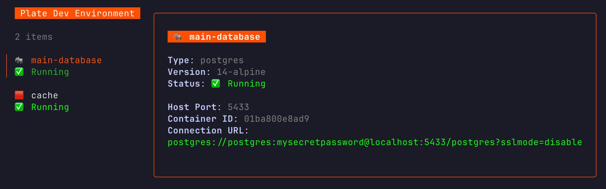

# 🍽️ Plate

**A deliciously simple TUI for managing your local development databases.**

Stop messing with complex `docker-compose` files for simple projects. Plate reads a dead-simple `plate.config.json` and spins up persistent, manageable database containers for you, all wrapped in a beautiful and intuitive terminal interface.



## ✨ Features

* **Declarative & Simple:** Define your services (Postgres, Redis, MySQL, MongoDB) in a clean `json` file.
* **Persistent Data:** Your data survives between sessions. Close the app and your database state is saved for the next run.
* **Interactive TUI:** A beautiful and responsive terminal interface built with Bubble Tea.
* **Full Lifecycle Management:** Boot, stop, reset, and delete services with single key presses.
* **Clipboard Integration:** Copy a service's connection string directly to your clipboard.

## Supported Services

| Service  | Default Version | Default Port |
| -------- | --------------- | ------------ |
| Postgres | `14-alpine`     | `5433`       |
| Redis    | `7`             | `6380`       |
| MySQL    | `8`             | `3307`       |
| MongoDB  | `latest`        | `27017`      |


## 🚀 Installation

This project is intended to be installed with a working Go environment.

Simply use `go install` to download, compile, and add the `plate` binary to your system path:

```bash
go install github.com/katistix/plate@latest
```

**Note:** For the `plate` command to be available system-wide, ensure that your Go bin directory is in your system's `PATH`. This is typically located at `$HOME/go/bin`. You can add it to your shell's configuration file (e.g., `~/.zshrc`, `~/.bash_profile`) like this:

```bash
export PATH=$PATH:$(go env GOPATH)/bin
```

## ▶️ Quick Start

1.  **Initialize a config file:** Run the `init` command in your project's root directory.

    ```bash
    plate init
    ```

    This will create a `plate.config.json` file with some sensible defaults.

2.  **Customize your config:** Open `plate.config.json` and edit it to fit your needs. Change versions, ports, or add new services.

    ```json
    {
      "services": [
        {
          "type": "postgres",
          "name": "main-db",
          "version": "14-alpine",
          "port": 5433
        },
        {
          "type": "redis",
          "name": "cache",
          "version": "7",
          "port": 6380
        },
        {
          "type": "mysql",
          "name": "main-db-2",
          "version": "8",
          "port": 3307
        }
      ]
    }
    ```

3.  **Launch the TUI:** Simply run `plate`!

    ```bash
    plate
    ```

## ⌨️ Commands

### CLI Commands

| Command                | Description                                                 |
| ---------------------- | ----------------------------------------------------------- |
| `plate`                | Starts the main TUI.                                        |
| `plate [path/to/file]` | Starts the TUI with a specific config file.                 |
| `plate init`           | Creates a boilerplate `plate.config.json` in the current dir. |
| `plate help`           | Shows the command-line help text.                           |

### In-App Commands

(Press `h` inside the app to see the full help screen)

| Key(s)         | Action                                                  |
| -------------- | ------------------------------------------------------- |
| `↑`/`↓`          | Navigate the list of services.                          |
| `h`            | Show/hide the in-app help screen.                       |
| `s`            | **S**top a running service.                             |
| `b`            | **B**oot a stopped service.                             |
| `c`            | **C**opy the connection string of a running service.    |
| `r`            | **R**eset a service (deletes data and recreates).       |
| `d`            | **D**elete a service (removes the container permanently). |
| `q` / `ctrl+c` | **Q**uit Plate (stops all running services).            |

## 🤝 Contributing

Contributions are welcome! Whether it's a bug report, a feature request, or a pull request, we'd love to hear from you.

1.  Fork the repository.
2.  Create your feature branch (`git checkout -b feature/AmazingFeature`).
3.  Commit your changes (`git commit -m 'Add some AmazingFeature'`).
4.  Push to the branch (`git push origin feature/AmazingFeature`).
5.  Open a Pull Request.

## 📜 License

This project is licensed under the Apache License 2.0 - see the `LICENSE` file for details.
